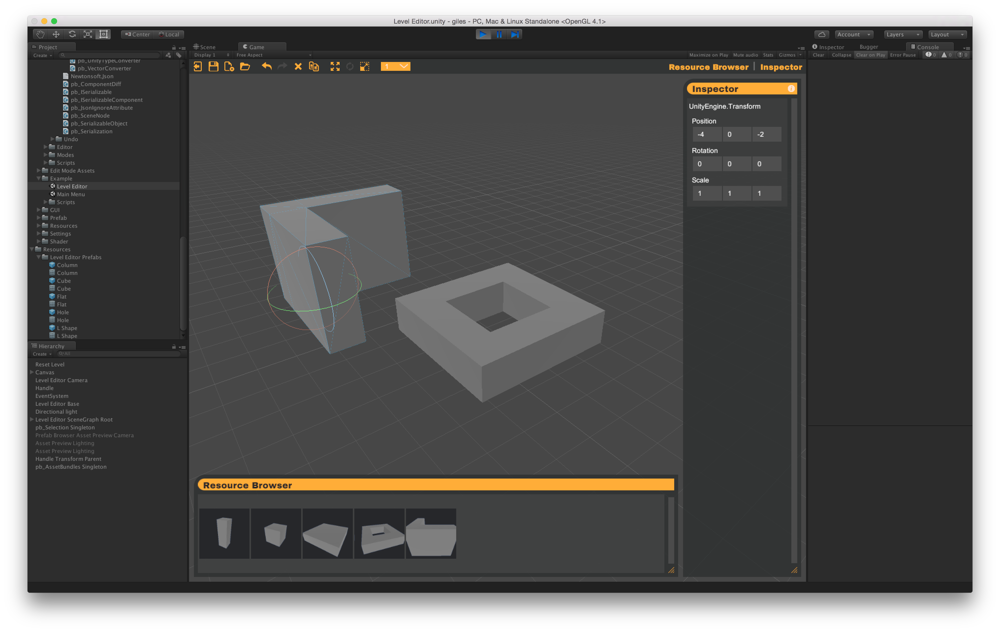

# giles

### A Runtime Level Editor for Unity3D

## What is it?

GILES is a runtime level editor for Unity games.  It is designed to be completely functional on it's own, but open to extensibility at every opportunity.

Out of the box here's what GILES provides:

- Selection manager
- Grid snapping
- Translate, rotate, and scale handles
- Scene save / load
	- Levels written to human-readable JSON.
	- Saves all objects in scene via reflection, no additional code required.
	- Writes only state deltas if prefabs are used.
	- Serialization process is customizable with both simple attributes or complete overloading.
- Undo/redo.

## Quick Start

- Install **Unity 2017.1** or greater.
- In Player Settings, set "API Compatibility Level" to ".NET 2.0"
- Open **GILES** project.
- Open *GILES/Example/Level Editor*

## Contributing

Bug reports should be submitted to the Issues queue on Github.  Feature requests should be either posted on the [forums](http://www.protoolsforunity3d.com/forum/) or contributed via pull request.
